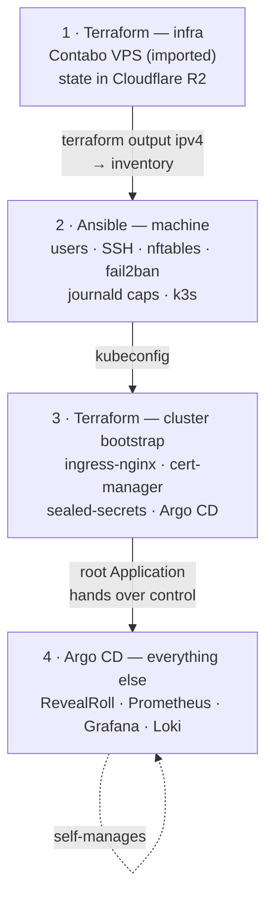

# RevealRoll Platform

Infrastructure for the **staging environment** of [RevealRoll](https://github.com/tutac/revealroll) —
a Next.js application whose production deployment lives on Vercel.

This repository runs that same application on a self-managed Kubernetes cluster: a Contabo VPS
provisioned with Terraform, hardened and clustered with Ansible, and continuously deployed by Argo CD
from this repo. It exists to be operated — provisioned, monitored, broken, and restored — rather than
merely to host.

**No application code here.** That lives in `tutac/revealroll`. This repo holds Terraform, Ansible,
Helm charts, Argo CD manifests, dashboards, alerts, and runbooks.

---

## The four layers



Every component belongs to exactly one layer:

| If the thing… | Owner |
|---|---|
| has a provider API and must exist before the cluster does | Terraform `01-infra` |
| is a file, package, service, or kernel setting on the host | Ansible |
| is one of the four bootstrap components Argo CD needs to run | Terraform `02-cluster-bootstrap` |
| is any other Kubernetes object | Argo CD, via Git |

Terraform's bootstrap stack installs **only** those four charts. Once Argo CD is running, Terraform
stops touching the cluster — from there, deploying is committing.

Full diagrams and the reasoning behind the seam: [`docs/architecture.md`](docs/architecture.md).

---

## URLs

| URL | What | Auth |
|---|---|---|
| https://stg.revealroll.com | RevealRoll staging | app login (Supabase staging) |
| https://argocd.stg.revealroll.com | Argo CD | `admin` — password in the password manager |
| https://grafana.stg.revealroll.com | Grafana | `admin` — password from a sealed secret |
| https://alertmanager.stg.revealroll.com | Alertmanager | basic auth |

Production (`revealroll.com`) is Vercel and is **not** managed from this repository.

DNS lives at Namecheap (BasicDNS): `stg` and `*.stg` A records point at the VPS. Terraform does not
manage DNS — if a hostname doesn't resolve, check Namecheap before debugging ingress.

---

## First run, from nothing

Each step consumes an output of the previous one. The order is a hard dependency, not a preference.

```bash
# 0. Credentials (gitignored .envrc — never committed)
export CNTB_OAUTH2_CLIENT_ID=… CNTB_OAUTH2_CLIENT_SECRET=… \
       CNTB_OAUTH2_USER=…      CNTB_OAUTH2_PASS=…
export AWS_ACCESS_KEY_ID=…     AWS_SECRET_ACCESS_KEY=…   # Cloudflare R2
export R2_ACCOUNT_ID=…

# 1. Infrastructure — imports the existing VPS
make tf-init tf-apply STACK=01-infra
make -s tf-output                       # → the IP for the Ansible inventory

# 2. The machine — first contact as root, once; then idempotent runs as `deploy`
cd ansible && ansible-playbook -i inventory/staging.yml playbooks/00-bootstrap.yml
make ansible-site

# 3. Kubeconfig onto your laptop
make kubeconfig
export KUBECONFIG=~/.kube/revealroll-staging.yaml && kubectl get nodes

# 4. Cluster bootstrap — the last thing Terraform installs into the cluster
make tf-init tf-apply STACK=02-cluster-bootstrap

# 5. Hand over to GitOps — the last manual kubectl of the project
kubectl apply -f gitops/root-app.yaml
```

---

## Deploying a change

**You don't run `kubectl` or `helm`.** A push to `tutac/revealroll` builds an image, pushes it to
`ghcr.io/tutac/revealroll:sha-<commit>`, and commits that tag into
`charts/revealroll/values-staging.yaml` here. Argo CD notices and applies it.

```bash
# what is running right now?
yq '.image.tag' charts/revealroll/values-staging.yaml

# roll back
git revert <bump-commit> && git push        # Argo syncs within ~3 minutes
```

Tags are always `sha-<commit>` and never `latest`. That is what makes the question above answerable
by reading one file, and rollback an operation you already know how to perform under pressure.

---

## Repository layout

| Path | Contents |
|---|---|
| `terraform/stacks/01-infra/` | Contabo instance (imported), R2 state backend |
| `terraform/stacks/02-cluster-bootstrap/` | the four bootstrap Helm releases + ClusterIssuers |
| `ansible/` | `00-bootstrap` → `10-harden` → `20-k3s` → `99-verify`, and seven roles |
| `charts/revealroll/` | the application's Helm chart |
| `gitops/` | app-of-apps root, AppProjects, Application manifests |
| `observability/` | Grafana dashboards (JSON) and PrometheusRule alerts |
| `secrets/staging/` | committed **SealedSecrets** — encrypted, safe in a public repo |
| `scripts/` | kubeconfig fetch, secret sealing, smoke test, etcd backup |
| `docs/runbooks/` | one runbook per alert, written before the alert |

**Lost?** [`.claude/codemap.md`](.claude/codemap.md) maps "I want to change X" to the file that does it.

---

## Operating

- **Never `kubectl apply`.** Argo CD will prune it or revert it. `kubectl` is for reading:
  `get`, `describe`, `logs`, `top`, `events`.
- **Every alert links to a runbook.** An alert without one is a page with no instructions.
- **Every incident gets written up** in [`.claude/memory/incidents.md`](.claude/memory/incidents.md),
  with detection time and what would have caught it sooner.
- **No plaintext secrets, ever.** Everything goes through `scripts/seal-env.sh`.

When something is broken, the triage order is in [`CLAUDE.md`](CLAUDE.md). Start at the top; most
outages are answered by step 2, and on a single node an unexpected number of them are a full disk.

---

## Before pushing

```bash
make lint      # terraform fmt + validate, ansible-lint, helm lint, kubeconform, gitleaks
```

CI runs exactly these. Running them locally first saves a round trip.

---

## Why decisions were made the way they were

[`.claude/memory/decisions.md`](.claude/memory/decisions.md) — k3s over kubeadm, Sealed Secrets over
Vault, nginx over Traefik, GitOps over `helm upgrade` from CI, and the known limitation that
`NEXT_PUBLIC_*` build args make images environment-specific.
