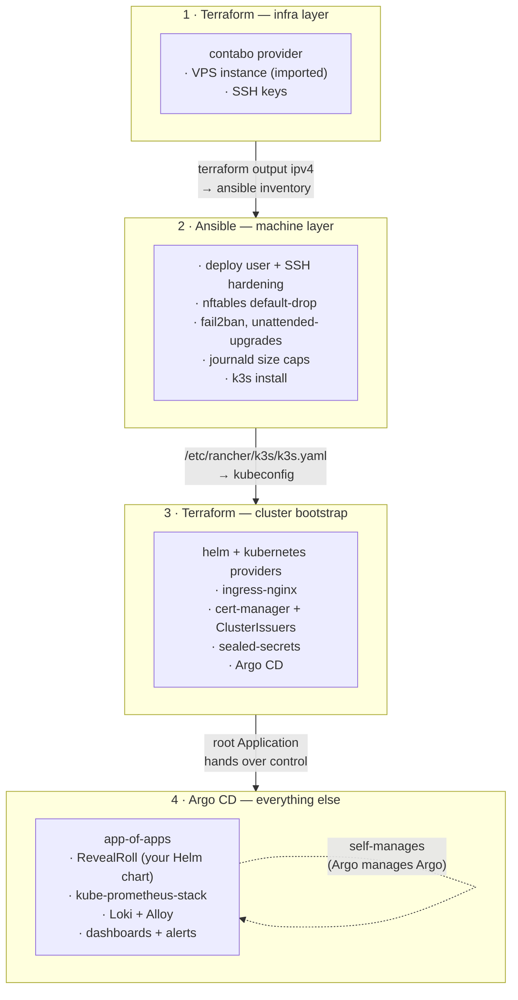
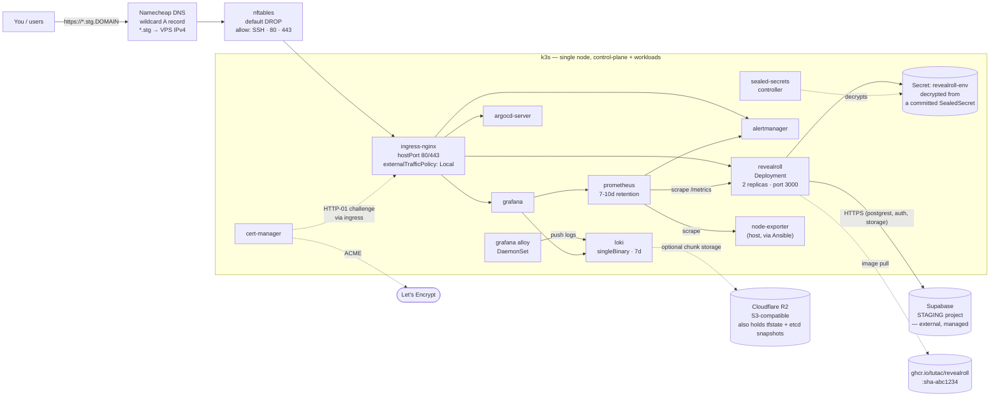
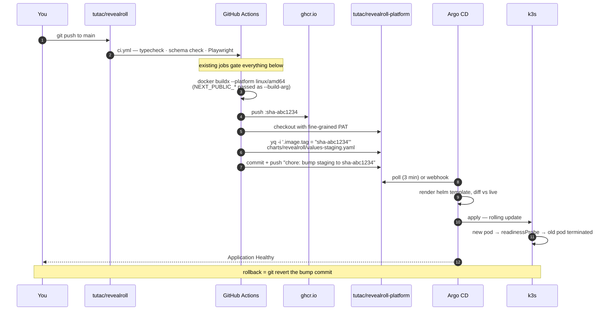

# Architecture

Three views of the same system. Re-read the relevant one before starting a stage — knowing *where a
piece sits* is most of understanding what it does.

---

## 1. Layer ownership — who owns what

The single most important idea in the project. Every component belongs to exactly one layer.

**The mechanical rule:**

| If the thing… | Owner |
|---|---|
| has a provider API and must exist before the cluster does | Terraform `01-infra` |
| is a file, package, service, or kernel setting on the host | Ansible |
| is one of the four bootstrap components Argo CD needs to exist at all | Terraform `02-cluster-bootstrap` |
| is any other Kubernetes object | Argo CD, via Git |

**Why layers, and why this seam.** The temptation on a single VPS is to do everything with one tool —
Ansible can `helm install`, Terraform has a `kubectl` provider, k3s can auto-deploy manifests from a
directory. Resist it. The seam exists because each layer has a different *reconciliation model*:
Terraform reconciles against remote state on demand, Ansible reconciles the OS on demand, Argo CD
reconciles the cluster continuously. Mixing them means a resource has two owners that disagree, and
you get a fight you didn't schedule — at 2 a.m., on the thing you last touched.

The handover point is deliberate: Terraform installs *only* what Argo CD needs to exist (an ingress
so you can reach it, certs so it's not on plain HTTP, sealed-secrets so it can decrypt what it syncs,
and Argo CD itself). After that, Terraform stops touching the cluster forever. Deployment becomes a
commit, and "what is running?" becomes a question you answer by reading Git.

---

## 2. Runtime topology — what's actually running on the box

**Things worth noticing:**

- **No LoadBalancer.** On a cloud provider, `Service type=LoadBalancer` provisions a real LB. Contabo
  has none, so ingress-nginx binds `hostPort` 80/443 directly on the node. This is why `servicelb`
  (klipper) is disabled at k3s install — it would otherwise try to do the same job, badly.
- **`externalTrafficPolicy: Local`** preserves the real client IP. Without it, every request appears
  to come from a node IP and your access logs, rate limits, and fail2ban rules become useless.
- **The database is outside the cluster.** Supabase staging is a managed service reached over HTTPS.
  That means no `StatefulSet`, no PVC, no backup burden here — but it also means an entire class of
  failure (network to Supabase, key rotation, rate limits) that your alerting must cover.
- **node-exporter is installed by Ansible, not Helm.** Deliberate: when the cluster is the thing that's
  broken, you still want host metrics. A monitoring component that dies with its subject is decoration.
- **One bucket, three jobs**: Terraform state, Loki chunks (optional), etcd snapshots. Cheap, and it
  forces you to learn S3-compatible auth once.

---

## 3. The GitOps loop — how code becomes a running pod

**Why the tag bump is a commit and not an API call.** The alternative (CI runs `helm upgrade`, or Argo
CD Image Updater watches the registry) works, but throws away the property that makes GitOps worth the
ceremony: **the desired state of the cluster is a file you can read, diff, review, and revert.** With a
commit-based bump, `git log charts/revealroll/values-staging.yaml` is a complete, auditable deployment
history, `git blame` tells you who shipped what, and rollback is an operation you already know how to
do under stress. With `helm upgrade` from CI, that history lives in Helm release secrets inside a
cluster that may be the thing that's on fire.

**Why `sha-<commit>` and never `latest`.** A mutable tag means two pods created a minute apart can run
different code, `kubectl describe` can't tell you what's deployed, and "roll back" has no target.
Immutable tags make the deployment identity and the source identity the same string.

**Where secrets enter.** Never through this loop. Secrets go in once, sealed, via a separate commit
in `secrets/staging/`. The image build only needs the *public* `NEXT_PUBLIC_*` values — and those are
build-time in Next.js, which is the single most common thing to get wrong here (see
`reference/env-mapping.md`).

---

## Failure domains — what takes down what

Useful for Stage 08 (what to alert on) and Stage 10 (what to drill).

| If this dies | Blast radius | Detected by | Runbook |
|---|---|---|---|
| The VPS | Everything | External uptime check (outside the box!) | `node-reboot.md` |
| Disk fills | k3s, then everything, confusingly | `node_filesystem_avail_bytes` alert | `disk-pressure.md` |
| ingress-nginx | All HTTP in; cluster fine internally | External check + no-traffic alert | `app-down.md` |
| cert-manager | Nothing today; TLS breaks in ~60 days | Cert-expiry alert (30d warning) | `cert-not-issuing.md` |
| Argo CD | Deploys stop; running app unaffected | Argo Application health alert | — |
| Prometheus | You go blind; app unaffected | Dead-man's-switch alert | — |
| The app pods | The app | Golden-signal + SLO burn-rate alerts | `app-down.md` |
| Supabase staging | App up, every request 5xx | Error-rate alert | `app-down.md` |
| Sealed-secrets key lost | Nothing now; every future re-seal breaks | Nothing — this is why you back it up | — |

Note the first row: **the uptime check must live outside this VPS.** A monitoring stack that runs on
the machine it monitors cannot tell you the machine is down. Use a free external checker
(UptimeRobot, Better Stack, or a GitHub Actions cron hitting the URL) as the outermost layer.
